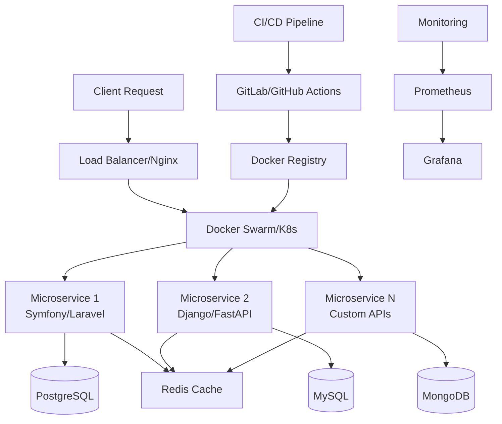

# 🚀 Alp | Full Stack Developer & DevOps Engineer

    

  
  
  

---

---

## 🛠️ Technology Stack & Expertise

### 🚀 Backend Frameworks & Languages

### 🐳 DevOps & Infrastructure

### 🗄️ Databases & Caching

### ☁️ Cloud & Monitoring

### 🔧 Development Tools

---

## 📊 GitHub Analytics & Performance

  
  

  

  

---

## 🏗️ Architecture & Development Approach

---

## 🚀 Featured Projects & Contributions

  

### 💼 Professional Project Highlights

- **🏢 Enterprise E-Commerce Platform**
  - Symfony 6 + Vue.js + Docker + Kubernetes
  - Microservices architecture with 99.9% uptime
  - Handles 10k+ concurrent users

- **🔐 Cybersecurity Management System**
  - Laravel + Django REST API + Redis
  - Real-time threat monitoring & response
  - Automated vulnerability scanning

- **📊 Analytics Dashboard**
  - PHP Backend + React Frontend
  - Real-time data processing with WebSockets
  - Deployed on AWS with auto-scaling

---

## 🎯 2025 Professional Goals

| Quarter | Objective | Technology Focus |
|---------|-----------|------------------|
| **Q2** | Master Advanced Kubernetes | Helm, Istio, Service Mesh |
| **Q3** | Cloud Native Architecture | AWS EKS, Serverless, Lambda |
| **Q4** | Open Source Contributions | Symfony Components, Laravel Packages |

### 🔥 Currently Learning
- **Event-Driven Architecture** with Apache Kafka
- **Advanced Security** practices and penetration testing
- **GraphQL** implementation with PHP
- **Terraform** for Infrastructure as Code

---

## 📈 Development Metrics

<!--START_SECTION:waka-->
<!--END_SECTION:waka-->

  
### 🏆 Professional Achievements

---

## 🤝 Professional Network & Contact

  

---

  
  
    
  
  
  

---

  🤖 <i>This README is automatically updated with my latest contributions and activities</i>

