<div align="center">

# 🚀 **ALP** | Senior Full Stack Developer & DevOps Architect


</div>

## 🎯 **Executive Summary**

<div align="center">

```php
<?php

namespace Alp\Professional\Profile;

use Enterprise\Architecture\Interface\{
    FullStackInterface, DevOpsInterface, CyberSecurityInterface
};

/**
 * Senior Full Stack Developer & DevOps Architect
 * Specializing in enterprise-grade scalable solutions
 */
class AlpDeveloper implements FullStackInterface, DevOpsInterface, CyberSecurityInterface 
{
    private const EXPERIENCE_YEARS = 5;
    private const PROJECTS_DELIVERED = 25;
    
    private array $coreExpertise = [
        'backend' => [
            'PHP' => ['Symfony 6+', 'Laravel 10+', 'CodeIgniter 4+'],
            'Python' => ['Django 4+', 'FastAPI', 'Flask'],
            'Architecture' => ['Microservices', 'Event-Driven', 'CQRS', 'DDD']
        ],
        'devops' => [
            'Containers' => ['Docker', 'Podman', 'Docker Swarm'],
            'Orchestration' => ['Kubernetes', 'Helm', 'Istio'],
            'Cloud' => ['AWS', 'GCP', 'Azure', 'DigitalOcean'],
            'IaC' => ['Terraform', 'Ansible', 'CloudFormation']
        ],
        'security' => [
            'Application' => ['OWASP Top 10', 'Secure Coding', 'Vulnerability Assessment'],
            'Infrastructure' => ['Network Security', 'Container Security', 'Cloud Security'],
            'Tools' => ['Burp Suite', 'OWASP ZAP', 'Nessus', 'Metasploit']
        ]
    ];
    
    public function getCurrentMission(): string 
    {
        return "Architecting and delivering enterprise-grade, cloud-native solutions 
                that scale seamlessly while maintaining highest security standards.";
    }
    
    public function getSpecializations(): array 
    {
        return [
            '🏗️ Microservices & Distributed Systems',
            '🐳 Container Orchestration & K8s',
            '☁️ Cloud-Native Architecture',
            '🔒 Application & Infrastructure Security',
            '⚡ High-Performance Backend Systems',
            '📊 Real-Time Data Processing',
            '🚀 CI/CD & DevOps Automation'
        ];
    }
}
```

</div>


## 🛠️ **Enterprise Technology Arsenal**

<div align="center">

### 🚀 **Backend & Framework Mastery**


### 🐳 **DevOps & Cloud Infrastructure**


### 🗄️ **Database & Data Management**


### 🔒 **Security & Monitoring**


### 🔧 **Development Ecosystem**


</div>


## 📊 **Performance Analytics & GitHub Insights**

<div align="center">
  


</div>

<div align="center">
  


</div>

<div align="center">
  


</div>


## 🏗️ **Enterprise Architecture & System Design**

```mermaid
graph TB
    A[🌐 Load Balancer<br/>Nginx/HAProxy] --> B[🚪 API Gateway<br/>Kong/Ambassador]
    B --> C[🐳 Container Orchestration<br/>Kubernetes Cluster]
    
    C --> D[⚡ Auth Service<br/>Symfony/JWT]
    C --> E[💼 Business Logic<br/>Laravel/Microservices]
    C --> F[📊 Analytics Service<br/>Django/FastAPI]
    C --> G[🔔 Notification Service<br/>PHP/RabbitMQ]
    
    D --> H[(🗄️ User DB<br/>PostgreSQL)]
    E --> I[(💾 Business DB<br/>MySQL)]
    F --> J[(📈 Analytics DB<br/>MongoDB)]
    
    D --> K[⚡ Redis Cache<br/>Session/Token Store]
    E --> K
    F --> K
    G --> K
    
    L[🔄 Message Queue<br/>Apache Kafka] --> E
    L --> F
    L --> G
    
    M[🚀 CI/CD Pipeline<br/>GitLab/GitHub Actions] --> N[📦 Container Registry<br/>Harbor/ECR]
    N --> C
    
    O[📊 Monitoring Stack] --> P[📈 Prometheus]
    P --> Q[📊 Grafana]
    O --> R[🔍 Jaeger Tracing]
    O --> S[📋 ELK Stack]
    
    T[🔒 Security Layer] --> U[🛡️ WAF/Cloudflare]
    T --> V[🔐 Vault/Secrets]
    T --> W[🔍 Security Scanning]
```

<div align="center">



</div>


## 🚀 **Showcase Projects & Enterprise Solutions**

<div align="center">
  
<a href="https://github.com/fetchAlp/yazilimciniz-master">

</a>

</div>

### 💼 **Enterprise Project Portfolio**

<table>
<tr>
<td width="50%" valign="top">

#### 🏢 **E-Commerce Microservices Platform**
**Technologies:** `Symfony 6` `Vue.js 3` `Docker` `Kubernetes`  
**Scale:** `10,000+ concurrent users` `99.9% uptime`  
**Features:**
- Event-driven microservices architecture
- Real-time inventory management
- Auto-scaling with HPA
- Multi-tenant SaaS solution

</td>
<td width="50%" valign="top">

#### 🔐 **Enterprise Security Management System**
**Technologies:** `Laravel 10` `Django REST` `Redis` `PostgreSQL`  
**Scale:** `24/7 monitoring` `Real-time alerts`  
**Features:**
- Advanced threat detection
- Automated vulnerability scanning
- SOC dashboard with analytics
- Compliance reporting (ISO 27001)

</td>
</tr>
<tr>
<td width="50%" valign="top">

#### 📊 **Real-Time Analytics Platform**
**Technologies:** `PHP 8.3` `React` `Apache Kafka` `ClickHouse`  
**Scale:** `1M+ events/second` `Sub-second latency`  
**Features:**
- Stream processing pipeline
- Custom dashboard builder
- ML-powered insights
- Multi-cloud deployment

</td>
<td width="50%" valign="top">

#### 🌐 **Cloud-Native CMS Platform**
**Technologies:** `CodeIgniter 4` `Docker Swarm` `AWS`  
**Scale:** `Multi-region` `CDN integration`  
**Features:**
- Headless CMS architecture
- GraphQL API endpoints
- Automated content delivery
- Edge computing optimization

</td>
</tr>
</table>


## 🎯 **Strategic Roadmap 2025**

<div align="center">

| **Quarter** | **Primary Objective** | **Technology Focus** | **Deliverables** |
|-------------|----------------------|---------------------|------------------|
| **Q2 2025** | Advanced Kubernetes Mastery | `Helm 3` `Istio Service Mesh` `ArgoCD` | Certified Kubernetes Administrator |
| **Q3 2025** | Cloud-Native Architecture | `AWS EKS` `Serverless` `Lambda Functions` | Multi-cloud deployment strategy |
| **Q4 2025** | Open Source Leadership | `Symfony Components` `Laravel Packages` | Major OSS contributions |

</div>

### 🔥 **Current Learning & Research**

<div align="center">


</div>


## 📈 **Professional Impact Metrics**

<!--START_SECTION:waka-->
<!--END_SECTION:waka-->

<div align="center">

### 🏆 **Achievement Highlights**


### 📊 **Performance Indicators**

| Metric | Achievement | Impact |
|--------|-------------|--------|
| **Code Quality** | SonarQube A+ Rating | Zero critical vulnerabilities |
| **Performance** | <100ms Response Time | 40% faster than industry standard |
| **Security** | OWASP Compliant | Zero security incidents |
| **Scalability** | 10x Traffic Growth | Seamless auto-scaling |

</div>


## 🤝 **Professional Network & Collaboration**

<div align="center">
  
[](https://linkedin.com/in/alp-fullstack-developer)
[](https://alp-enterprise-solutions.com)
[](mailto:alp@enterprise-solutions.dev)
[](https://stackoverflow.com/users/alp-developer)

</div>

<div align="center">

### 🌟 **Contribution Areas**


</div>


<div align="center">


<br><br>


</div>

<div align="center">
  <sub>🚀 <i>Continuously evolving, always innovating | Last updated automatically</i></sub>
</div>
